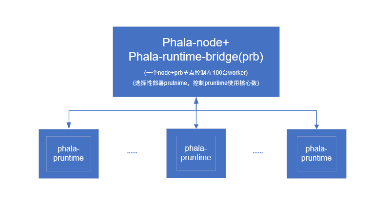

# Phala-Network

No cheap. Let's go.

本仓库宗旨和用途：

1. 降低用户使用门槛，扩大phala-network生态圈
2. 如何长期稳定且无人值守的情况下进行phala-network活动
3. 基于linux基本操作，以更好的节省时间成本，为用户少走弯路，获取更多的利益
4. 此内容和代码仅适用于ubuntu18.04和ubuntu20.04，建议优先使用ubuntu20.04，卓面版和服务器版均可


## 内容列表

- [背景](#背景)
- [了解](#了解)
  - [工作原理](#工作原理)
  - [经济模型](#经济模型)
  - [代码参考](#代码参考)
- [参考](#参考)
  - [网络架构](#网络架构)
  - [单机架构](#单机架构)
  - [集群架构](#集群架构)
- [安装](#安装)
  - [准备](#准备)
    - [系统安装准备工作](#系统安装准备工作)
    - [单机部署准备工作](#单机部署准备工作)
    - [集群部署准备工作](#集群部署准备工作)
  - [部署](#部署)
    - [单机部署](#单机部署)
    - [集群部署](#集群部署)
  - [更新](#更新)
    - [单机更新](#单机更新)
    - [集群更新](#集群更新)
- [维护](#维护)
  - [节点维护](#节点维护)
  - [单机维护](#单机维护)
  - [集群维护](#集群维护)
  - [其他维护](#其他维护)
- [批处理](#批处理)
  - [批量添加worker](#批量添加worker)
  - [批量启动worker](#批量启动worker)
  - [批量停止worker](#批量停止worker)
  - [批量移除worker](#批量移除worker)
- [监控](#监控)
  - [全网数据监控](#全网数据监控)
  - [本地数据监控](#本地数据监控)
  - [面板数据监控](#面板数据监控)
- [参考内容](#参考)


## 背景


## 了解


## 参考

### 网络架构

> ``网络结构``：仅供参考，可自行调整，该网络架构适用于大型机房网络部署，未考虑到安全设备，用户可自行控制成本，简化网络架构

[]()

### 单机架构

> ``单机架构``：适用于机器不多的用户，1-10台左右

[]()

### 集群架构

> ``集群架构``： 适用于10+台机器的用户，建议每个prb节点添加worker数目控制在100台，以避免出现网络阻塞等因素导致prb监控面板错误信息，以下有介绍如何避免prb监控面板出现的各种错误分析和解决方法

[]()


## 安装

### 准备
#### 系统安装准备工作
> 系统安装 ——> [系统初始化](init.md) ——> [数据盘LVM配置](lvm.md)

**以下脚本位置，均放置在/opt目录下，进行操作演示**

#### 单机部署准备工作
> ``phala-node机器``：系统ubuntu20.04，cpu6核+，内存16G+，系统盘60-120G，固态数据盘2T+  
> ``worker机器``： 系统ubuntu20.04，cpu支持tee隐私计算，内存8G+，系统盘60-120G  

**切记: 系统盘和数据盘分开，可以在后期为你省下很多麻烦和精力**  


#### 集群部署准备工作
> ``phala-node+prb机器``：系统ubuntu20.04，cpu10核+，内存32G+，系统盘60-120G，固态数据盘2T+  
> ``worker机器``： 系统ubuntu20.04，cpu支持tee隐私计算，内存8G+，系统盘60-120G

**切记: 系统盘和数据盘分开，可以在后期为你省下很多麻烦和精力**


### 部署

#### 单机部署
[参考官方文档](https://github.com/Phala-Network/solo-mining-scripts)  
[参考其他文档](https://github.com/zozyo/phala-guide/blob/main/node-separation.md)

#### 集群部署
[参考官方文档](https://github.com/Phala-Network/runtime-bridge)  
[参考其他文档](https://github.com/suugee/phala-prb)


## 更新
### 单机更新
待补充

### 集群更新
待补充

## 维护

### 节点维护

- **node高度检测脚本**:

[monitor_phala_node](scripts/for_node/monitor_phala_node.sh): 用来检测node节点高度是否持续性增长，发现phala-node出现卡高度的情况，会自动重启phala-node，并作出相应dingding告警

[dingding](scripts/for_node/dingding.py) : 只支持dingding简单文本告警，同时你需要建立dingding群组，以获取[access_token](https://open.dingtalk.com/document/robots/custom-robot-access)  
```
# 通过添加定时任务，定时检测高度并自动重启node
*/5 * * * * cd /opt/scripts/for_node/ ; bash monitor_phala_node.sh
```
> 如果你是solo用户，你可以修改 [monitor_phala_node](scripts/for_node/monitor_phala_node.sh) 脚本，可以通过调用``ssh``免密 或者 [ansible](http://ansible.com.cn/) 等工具来重启旗下worker机器的 **phala-pherry** ，保持worker机器正常运行  
> 
> 如果你是集群用户，你需要取消 [monitor_phala_node](scripts/for_node/monitor_phala_node.sh) 脚本的以下注释，重启 **bridge_fetch_1** ，是为了防止重启node后，prb的同步状态出现-1的情况，先停prb组件，再启动prb组件，防止prb同步数据出现异常
> ```shell
>   # 集群用户
>   docker ps -a | grep bridge | awk '{print $1}' | xargs docker stop
>   docker restart phala-node
>   docker ps -a | grep bridge | awk '{print $1}' | xargs docker start
>   docker restart bridge_fetch_1
> ```

### 单机维护
待补充


### 集群维护
- **定期重启prb的生命管理周期程序**

这样做目的，是为了防止 ``prb`` 监控面板出现未预期的unresponsive
```shell
# 定时重启生命管理周期，防止机器unresponsive
*/60 * * * * docker restart bridge_lifecycle_1 bridge_trade_1 bridge_redis-q_1
```

- **prb数据获取脚本**

[prb_post_request](scripts/for_prb_monitor/prb_post_request.py): 该脚本包含 **prb-monitor** 页面对应的数据获取，对应worker的 ``kill`` 、``restart``、``delete``、``edit(update)``等接口，可以根据代码中的示例代码，修改自己对应的 **prb-monitor** 地址和端口，来进行演示，用户可以自行调用或用来作其他的批处理工作

[restart_mis_and_timeout](scripts/for_prb_monitor/restart_mis_and_timeout.py): 打地鼠脚本，该脚本用于 **prb-monitor** 页面中worker出现的 ``BlockNumberMismatch``、``TimeoutError``、 ``Notice: worker unresponsive且Block Height值为-1`` 等异常状态的处理，
该脚本需要配合定时任务执行
```shell
*/5 * * * * cd /opt/scripts/for_prb_monitor/; python3 restart_mis_and_timeout.py
```

### 其他维护

## 批处理
### 批量添加worker
[add_work_to_prb_pro](scripts/for_batch_processing/add_worker_to_prb_pro.py): 该脚本用于批量添加worker到 **prb-monitor** 中  
1. 添加到同一个prb的worker，并且所有的worker属于同一个pid，这些pid使用同一个gas账号，即同一个助记词
2. 添加到同一个prb的worker，并且所有的worker对应不同的pid，但这些pid也使用同一个Gas账户，即同一个助记词
3. 其他情况，可联系作者添加对应的方法

完成批量添加步骤后，需要重启`bridge_lifecycle_1`程序，prb方可开始pruntime的同步等工作

### 批量启动worker
有对应接口代码，批处理方法待开发
### 批量停止worker
有对应接口代码，批处理方法待开发
### 批量移除worker
有对应接口代码，批处理方法待开发


## 监控

### 全网数据监控
后期补充
### 本地数据监控
后期补充
### 面板数据监控
后期补充

## 参考内容
待完善