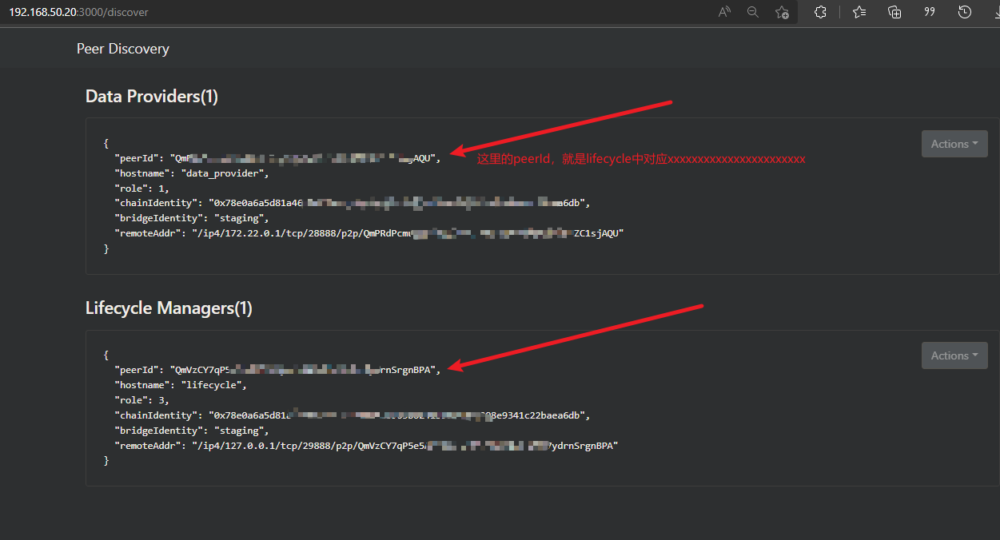

# PRB2.0


## 内容列表

- [组件介绍](#组件介绍)
- [基本架构](#基本架构)
- [全新部署](#全新部署)
  - [单机部署](#单机部署)
  - [分离部署](#分离部署)
- [prbV0迁移到V2](#prbV0迁移到V2)
- [批量添加pools和workers](#批量添加pools和workers)


## 组件介绍
> [参考官方文档](https://github.com/Phala-Network/runtime-bridge/wiki/Deployment-Guide-for-Runtime-Bridge-2)


## 基本架构
> 该架构，采用`data_provider`与其他`lifecycle`组件分离的模式，当然也可以将两种合并在同一台机器上，用户可以选择灵活的部署方式，仅供参考  
> 官方采用了libp2p来各个组件的相互发现，在部署了多台`data_providers`后，进入`monitor`页面，会有所有的发现列表，这样用户可以修改`docker-compose`中对应的`lifecycle`的`PHALA_WALKIE_BOOT_NODES`字段值，可以填写多个`data_providers`的`peerId`，来实现多个`phala-node`与`data_providers`的高可用性，来支援多个PRB节点(即lifecycle及其相关组件)

[]()


## 全新部署
> `docker-compose`文件源自 [Phala-Network](https://github.com/Phala-Network) 官方成员 [将军](https://github.com/jasl) ，供大家参考

### 单机部署
> 单机部署全组件，使用`docker-compose.yml`文件，配置文件如下：
```yaml
# version: "3"
version: "2"

x-defaults: &defaults
  volumes: &default-volume-config
    - ./data:/var/data

services:
  data_provider:
    image: phalanetwork/prb:next
    hostname: data_provider
    network_mode: host
    restart: always
    volumes: *default-volume-config
    logging:
      options:
        # 保存的日志大小
        # max-size: "1g"
        max-size: "500m"
    environment:
      # 要启动的模块
      - PHALA_MODULE=data_provider

      # 应用程序环境，设置为开发以将应用置于开发模式
      - NODE_ENV=development

      # 记录日志级别
      - PHALA_LOGGER_LEVEL=debug

      # 要和 PRB 的 lifecycle 的相同环境变量保持一致
      - PHALA_BRIDGE_IDENTITY=staging

      # WebSocket端点到中继链的Substrate RPC(例如，对于Khala来说，它是Kusama)
      # 配置phala-node节点地址和对应端口
      - PHALA_PARENT_CHAIN_ENDPOINT=ws://127.0.0.1:9945
      # 指向副链的 Substrate RPC 的 WebSocket 端点（这里指向khala）。
      # 配置phala-node节点地址和对应端口
      - PHALA_CHAIN_ENDPOINT=ws://127.0.0.1:9944

      # libp2p 的侦听地址的多地址（https://github.com/libp2p/specs/tree/master/addressing）
      # 默认为'/ip4/0.0.0.0/tcp/0，/ip6/：：/tcp/0'，这意味着在每个接口上侦听一个随机端口。
      # 仅支持 TCP 协议。在地址之间使用逗号。配置127.0.0.1可能会无法被发现
      # - PHALA_WALKIE_LISTEN_ADDRESSES=/ip4/127.0.0.1/tcp/28888,/ip6/::/tcp/28889
      - PHALA_WALKIE_LISTEN_ADDRESSES=/ip4/0.0.0.0/tcp/28888,/ip6/::/tcp/28889

      # 用于对等发现的引导节点的多添加列表默认为"/ip4/0.0.0.0/tcp/18888，/ip6/：：/tcp/28889"，这意味着没有引导节点。
      # 仅支持 TCP 协议。在地址之间使用逗号。
      # - PHALA_WALKIE_BOOT_NODES=/ip4/0.0.0.0/tcp/18888，/ip6/：：/tcp/28889
      - PHALA_WALKIE_BOOT_NODES=/ip4/0.0.0.0/tcp/18888,/ip6/::/tcp/18889

      # BLOB服务session使用的最大内存为64G
      - PHALA_LIFECYCLE_BLOB_SERVER_SESSION_MAX_MEMORY=64

      # 存储标识密钥的路径默认为"./data/keys/id"，默认存储./data/keys/id
      # - PHALA_PEER_ID_PREFIX=./data/keys/id

      # the blob server, defaults to 8012
      # PHALA_DATA_PROVIDER_LOCAL_SERVER_PORT=8012

      # The path to database, defaults to './data/0'.
      # - PHALA_LOCAL_DB_PATH=

    entrypoint:
      - "node"
      - "--trace-warnings"
      - "--experimental-json-modules"
      - "--es-module-specifier-resolution=node"
      - "--harmony-top-level-await"
      # - "--trace-gc"
      # - "--expose-gc"
      # - "--no-compilation-cache"
      # - "--max-old-space-size=10240"
      # - "--max-heap-size=100"
      # - "--no-always-promote-young-mc"
      - "dist/index"

  monitor:
    image: phalanetwork/prb-monitor:next
    # image: phalanetwork/prb-monitor
    hostname: monitor
    network_mode: host
    environment:
      - NS_FETCH=fetch
      - NEXT_PUBLIC_NS_LIST=default
      - PTP_BOOT_NODES=/ip4/127.0.0.1/tcp/28888
    # ports:
    #   - "3000:3000"


###### prb部分 ######
# # version: "3"
# version: "2"
# 
# x-defaults: &defaults
#   volumes: &default-volume-config
#     - ./data:/var/data

# services:
  redis-q:
    network_mode: host
    image: redis:alpine
    hostname: redis-q
    restart: always
    logging:
      options:
        max-size: "1g"
    command: ["redis-server", "--port", "63792", "--appendonly", "no", '--save', '']
    # ports:
    #   - "63792:63792"

  arena:
    network_mode: host
    image: phalanetwork/prb:next
    hostname: arena
    restart: always
    depends_on:
      - redis-q
    environment:
      - PHALA_MODULE=utils/arena
      - NODE_ENV=development
      - PHALA_LOGGER_LEVEL=debug
      - PHALA_NAMESPACE=default
      - REDIS_ENDPOINT=redis://127.0.0.1:63792/
    # ports:
    #   - "4567:4567"

  trade:
    network_mode: host
    image: phalanetwork/prb:next
    hostname: trade
    restart: always
    volumes: *default-volume-config
    logging:
      options:
        # max-size: "1g"
        max-size: "500m"
    depends_on:
      - redis-q
    environment:
      - PHALA_MODULE=trade
      - NODE_ENV=development
      - PHALA_DB_NAMESPACE=default
      - PHALA_DB_FETCH_NAMESPACE=fetch
      - PHALA_DB_ENDPOINT=redis://127.0.0.1:6666
      - PHALA_LOGGER_LEVEL=debug
      - PHALA_PARENT_CHAIN_ENDPOINT=ws://127.0.0.1:9945
      - PHALA_CHAIN_ENDPOINT=ws://127.0.0.1:9944
      - PHALA_Q_REDIS_ENDPOINT=redis://127.0.0.1:63792/
    entrypoint:
      - "node"
      - "--trace-warnings"
      - "--experimental-json-modules"
      - "--es-module-specifier-resolution=node"
      - "--harmony-top-level-await"
      # - "--max-old-space-size=10240"
      - "dist/index"

  lifecycle:
    network_mode: host
    image: phalanetwork/prb:next
    hostname: lifecycle
    restart: always
    depends_on:
      - redis-q
    volumes: *default-volume-config
    logging:
      options:
        # max-size: "1g"
        max-size: "500m"
    environment:
      # 默认为false
      # - PHALA_SYNC_ONLY=true
      # - PHALA_SYNC_ONLY=false
      - PHALA_MODULE=lifecycle
      - NODE_ENV=development
      - PHALA_LOGGER_LEVEL=debug

      # 要和 dp 的 data_provider 的相同环境变量保持一致
      - PHALA_BRIDGE_IDENTITY=staging

      - PHALA_Q_REDIS_ENDPOINT=redis://127.0.0.1:63792/

      - PHALA_PARENT_CHAIN_ENDPOINT=ws://127.0.0.1:9945
      - PHALA_CHAIN_ENDPOINT=ws://127.0.0.1:9944

      # The size of LRU cache, defaults to 5000.
      - PHALA_LRU_CACHE_SIZE=50
      # LRU 缓存中项目的最大时间（以毫秒为单位），默认为 30 分钟。
      - PHALA_LRU_CACHE_MAX_AGE=90000

      - PHALA_PRPC_REQUEST_TIMEOUT=60000

      # 应该是同一时间点，lifecycle一次性同步的最大worker数
      - PHALA_RUNNER_MAX_WORKER_NUMBER=150

      # 是否应该进入配置模式，它将仅启动 API 以添加/修改已保存的pools和workers，
      # - PHALA_ENFORCE_MIN_BENCH_SCORE=true

      # - PHALA_WALKIE_BOOT_NODES=/ip4/10.87.0.51/tcp/28888/p2p/QmbgiLdgeBhVmCfDtrFzC158HCkRTC4J38tZay2T3uxjtJ,/ip4/10.87.0.52/tcp/28888/p2p/QmWhwPfb2VtuBQtrepw9shoafGmvnXdKu8fNq7Yfw32jCN
      - PHALA_WALKIE_BOOT_NODES=/ip4/127.0.0.1/tcp/28888/p2p/{YOUR DATA PROVIDERS's PEERID}
      # - PHALA_WALKIE_LISTEN_ADDRESSES=/ip4/127.0.0.1/tcp/29888,/ip6/::/tcp/29889
      - PHALA_WALKIE_LISTEN_ADDRESSES=/ip4/0.0.0.0/tcp/29888,/ip6/::/tcp/29889

    mem_swappiness: 70
    entrypoint:
      - "node"
      - "--trace-warnings"
      - "--experimental-json-modules"
      - "--es-module-specifier-resolution=node"
      - "--harmony-top-level-await"
      - "dist/index"
    # ports:
    #   - "29888:29888"

```

启动prb2.0所有组件
```shell
docker-compose -f bridge_2/docker-compose.yml up d

# 或者
cd bridge_2
docker-compose -f docker-compose.yml up -d

# 查看服务运行状态
docker ps -a
```

等待`data_provider`同步`phala-node`数据，根据我的测试，该时长花费大约 **1~2** 天，但是占用磁盘用量同比减少 **三分之二**

使用浏览器访问monitor地址
> http://127.0.0.1:3000 或 `http://对应的机器IP:3000`

[]()

Ok, enjoy it like a girl!

### 分离部署
> data_providers与phala-node同机  
> 参考 [docker-compose.dp.sample.yml](./docker-compose.dp.sample.yml)文件，启动`data_providers`与`monitor`


> lifecycle与其他组件同机  
> 参考 [docker-compose.prb.sample.yml](./docker-compose.prb.sample.yml) 文件，启动`lifecycle`和其他剩余组件


## prbV0迁移到V2
> [参考官方文档](https://github.com/Phala-Network/runtime-bridge/wiki/Migrate-from-v0-to-v2)  

从旧`prb`数据迁移到`prb2.0`
1. 停止目前所有的旧prb运行的组件
2. 修改和核对[docker-compose-V0-to-V2.yml](./docker-compose-V0-to-V2.yml) 文件中的
```yml
  volumes: &default-volume-config
    # /opt/prb10/data为旧prb存放的数据目录，/var/data_old为data_provider容器映射逻辑卷目录不可修改，保持不变
    # /opt/prb20/data_1为新prb存储的数据目录(需要新建), data_provider服务会将旧prb中的数据，
    # 迁移和转换到容器目录/var/data(该目录不可修改，保持不变)中，即/opt/prb20/data_1目录，用户可以自行修改
    - /opt/prb10/data:/var/data_old 
    - /opt/prb20/data_1:/var/data
```
3. 运行数据迁移程序(该数据迁移时长暂未测试，需要用户自行测试时长，应该不会超过1天，可能数个小时)
```shell
# 启动并运行服务
docker-compose -f docker-compose-V0-to-V2.yml up -d
# 查看运行情况
docker-compose ps -a 
# 查看data_provider服务日志
docker-compose logs -f --tail=100 data_provider
```


## 批量添加pools和workers
> 目前只支持单机批量添加

[add_worker_to_prb_pro_2](/scripts/for_add_pools_and_workers_20/add_worker_to_prb_pro_2.0.py) 脚本  
```python3
    # '''示例代码'''
    # worker_ips.txt文件，放置要添加到同一个prb的worker对应的ip地址，一行一个
    # worker_pids_ips.txt文件，放置要添加到同一个prb的worker对应的pid和ip，以 : 分隔，一行一个

    your_pid = 83
    mnemonic1 = 'xxx xxx xxx xxx xxx xxx xxx xxx xxx xxx xxx xxx'
    ip_port1 = '192.168.2.100:3000'
    add_worker_for_ip(pid=your_pid,
                      ip_port=ip_port1,
                      mnemonic=mnemonic1,
                      txt='./worker_ips.txt')

    mnemonic2 = 'xxx xxx xxx xxx xxx xxx xxx xxx xxx xxx xxx xxx'
    ip_port2 = '192.168.3.100:3000'
    add_worker_for_pid_ip(ip_port=ip_port2,
                          mnemonic=mnemonic2,
                          txt='./worker_pids_ips.txt')

    # 其他情况，用户可自行添加
```