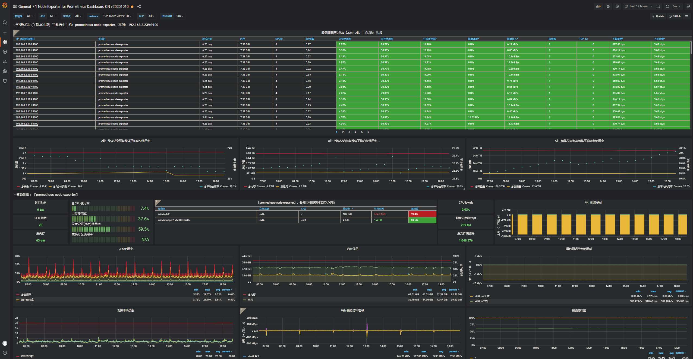
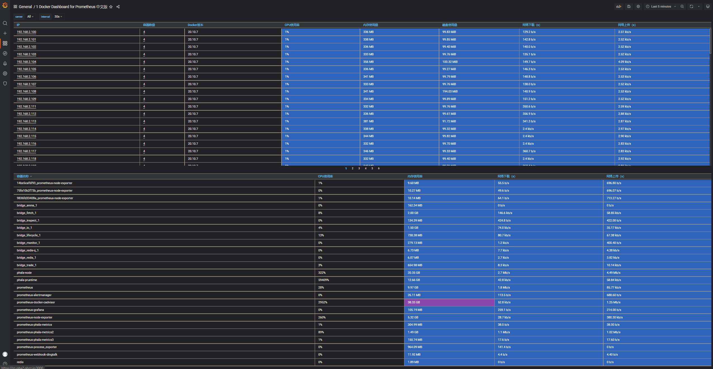
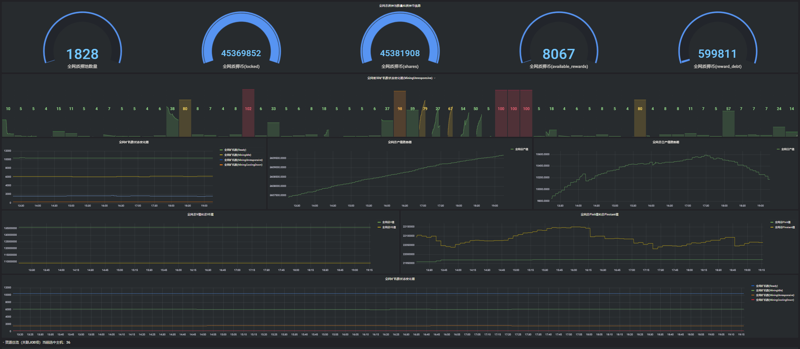
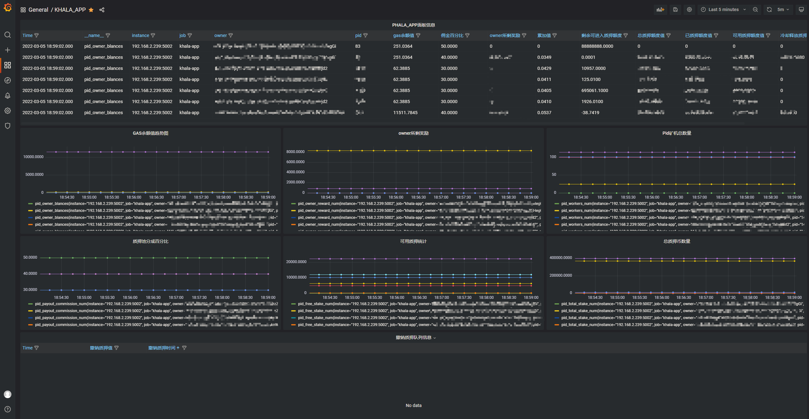

# Monitor系统

简单点，直接跑吧

## 运行 Prometheus
1. 修改`dingding.yml`文件中的 [access_token](https://open.dingtalk.com/document/robots/custom-robot-access) 用来接受`prometheus`的监控信息告警
2. 修改`albert-rules.yml`文件中的`ip`地址，对应你的`监控实例`地址
3. 修改`prometheus.yml`文件， 
   1. 配置`alertmanagers`中，对应的告警组件`alertmanagers`的ip和port
   2. 如果需要监控所有worker机器，请配置在`node`和`docker`的`job_name`中
   3. 其他的地址和端口，请对应修改
4. `docker-compose.yml`文件包含了所有的监控程序，`docker-compose up -d`运行即可
5. `docker-compose-node`用于在所有worker上，构建监控组件，包含进程监控、docker监控，节点监控等

## 配置 Grafana
workers系统参数监控模板：  
`docker_process.json` 和 `worker_for_node.json`，可以直接导入json文件，也可以从 [workers系统参数监控模板](https://grafana.com/dashboards/8919) 和 [workersDocker监控模板](https://grafana.com/dashboards/8919) 获取

worker_for_node展示效果：  
  

docker_process展示效果：  
  

更多 [dashboards](https://grafana.com/dashboards/) ，用户可以自行选择

## 后期开放主网`phala-networker`数据获取与数据展示效果  
效果图如下：   
- 全网数据效果图1  
  

- 全网数据效果图2  
  

- 全网数据效果图3  
  

- PRB本地数据效果图  
  

- APP面板数据效果图  
  
